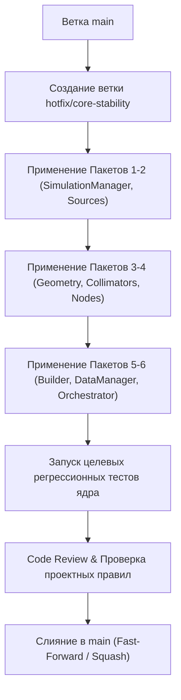

# План хотфикса ядра моделирования (Hotfix Core Stability) для ветки `main`

## 1. Контекст и цели

В ходе разработки ветки `feature/gui-integration` в расчетном ядре (`core/`) был выявлен и устранен ряд критических дефектов. Данные ошибки приводят к аварийным завершениям моделирования (Crash/Panic), переполнениям кольцевых буферов, дедлокам процессов, утечкам дескрипторов файлов HDF5, рассинхронизации геометрии в памяти и искажению физических вероятностей.

**Главная цель хотфикса:**
Перенести в ветку `main` исключительно критически важные исправления ядра в виде изолированного патча **без включения** UI/IPC-компонентов (`gui/`, `GuiStreamDataHandler`, `DoseGridNode`/`DoseMapHandler` и экспортера конфигураций).

---

## 2. Архитектурные требования и инварианты

Все изменения в рамках хотфикса обязаны строго следовать контрактам проекта `NMSimToolkit`:
1. **Чистое расчетное ядро (`core/`):** Никаких импортов GUI-библиотек (`PySide6`, `pyqtgraph` и др.), никаких атрибутов отображения.
2. **Запрет утиной типизации:** Запрещено использование `hasattr()`, `getattr()` и динамического `setattr()`. Все контракты строго типизированы и явны.
3. **Только Top-Level импорты:** Искоренение локальных вызовов `import` внутри методов и функций (за исключением изолированных воркеров `multiprocessing`).
4. **Специфичная обработка исключений:** Запрет `except Exception: pass`. Все ошибки перехватываются точечно (`ValueError`, `OSError`, `KeyError`).

---

## 3. Реестр компонентов и исправляемых дефектов

### Пакет 1. Стабильность буферов и управления SimulationManager
**Файл:** [`core/transport/simulation_managers.py`](file:///d:/Python%20Projects/NMSimToolkit-Refactor/core/transport/simulation_managers.py)

1. **Защита от переполнения буфера выбывших частиц (`dead_particles`):**
   - **Дефект:** При гибели более `capacity` частиц за один шаг моделирования метод `append(dead_ids)` вызывал фатальный `IndexError`.
   - **Решение:** Порционная разбивка `dead_ids` на чанки размером не более `capacity` с вызовом `flush_dead_particles()` при исчерпании `remaining_capacity`.
2. **Безопасная регистрация сигналов ОС:**
   - **Дефект:** `signal(SIGINT, self.sigint_handler)` вызывался безусловно в `__init__`. Вторичные потоки и воркеры пулов падали с `ValueError: signal only works in main thread`.
   - **Решение:** Оборачивание в `try ... except (ValueError, AttributeError): pass`.
3. **Кооперативная остановка и пауза:**
   - **Дефект:** Присвоение `stop_time = 0` не останавливало симуляцию при наличии активных частиц в банке.
   - **Решение:** Введение `_stop_event = threading.Event()`, `_pause_event = threading.Event()`, методов `stop()`, `pause()`, `resume()`, `state: SimulationState`.
4. **Хронологический порядок сброса буферов (Flush Order Bug):**
   - **Дефект:** `flush_interactions()` вызывался раньше `flush_initial_states()`, что ломало связность треков в `HistoryAssemblerHandler`.
   - **Решение:** Строгий порядок: `flush_initial_states()` -> `flush_interactions()` -> `flush_dead_particles()`.
5. **Пропускная способность очереди IPC:**
   - **Дефект:** Очередь `Queue(maxsize=1)` вызывала постоянные простои расчетного ядра.
   - **Решение:** Увеличение емкости до `Queue(maxsize=64)`.
6. **Воспроизводимость случайных последовательностей (RNG Seed):**
   - **Решение:** Поддержка аргумента `seed: Optional[int] = None` с трансляцией генератора в активные источники.

---

### Пакет 2. Источники излучения и таблица эмиссии
**Файл:** [`core/source/sources.py`](file:///d:/Python%20Projects/NMSimToolkit-Refactor/core/source/sources.py)

1. **Защита от деления на 0 при инициализации:**
   - **Дефект:** `self.distribution /= np.sum(self.distribution)` вызывало `ZeroDivisionError` при нулевом массиве.
   - **Решение:** Проверка `total = Float(np.sum(arr)); if total > 0.0: ...`.
2. **Устранение погрешности суммы вероятностей:**
   - **Дефект:** Округление `float32`/`float64` приводило к суммам вида `1.0000001` или `0.9999999`, вызывая краш `ValueError: probabilities do not sum to 1` в `np.random.choice`.
   - **Решение:** Вторичная нормализация `prob_values = prob_values / prob_sum` в `_generate_emission_table`.
3. **Свойства-сеттеры с автоматическим пересчетом эмиссии:**
   - **Дефект:** Изменение `distribution` или `voxel_size` не обновляло габариты `size` и таблицу `emission_table`.
   - **Решение:** Реализация `@property distribution` и `@property voxel_size` с автоматическим вызовом `_generate_emission_table()`.
4. **Совместимость загрузки фантомов NumPy:**
   - **Дефект:** `SourcePhantom` падал в новых версиях NumPy из-за отсутствия `allow_pickle=True`.
   - **Решение:** Добавлен `allow_pickle=True` при вызове `np.load`.

---

### Пакет 3. Геометрия, Woodcock и параметрические коллиматоры
**Файлы:**
- [`core/geometry/woodcock_volumes.py`](file:///d:/Python%20Projects/NMSimToolkit-Refactor/core/geometry/woodcock_volumes.py)
- [`core/geometry/parametric_collimators.py`](file:///d:/Python%20Projects/NMSimToolkit-Refactor/core/geometry/parametric_collimators.py)
- [`core/geometry/volumes.py`](file:///d:/Python%20Projects/NMSimToolkit-Refactor/core/geometry/volumes.py)
- [`core/geometry/flattened_scene.py`](file:///d:/Python%20Projects/NMSimToolkit-Refactor/core/geometry/flattened_scene.py)
- [`core/geometry/gamma_cameras.py`](file:///d:/Python%20Projects/NMSimToolkit-Refactor/core/geometry/gamma_cameras.py)

1. **Сброс скомпилированного кэша функций материалов Numba (`_cfunc`):**
   - **Дефект:** При модификации параметров коллиматора старая Numba C-функция оставалась активной, симуляция рассчитывалась по устаревшей геометрии.
   - **Решение:** Переопределение `invalidate_geometry()` в `WoodcockParametricVolume` со сбросом `self._cfunc = None`.
2. **Свойства коллиматоров и пересчет констант:**
   - **Решение:** Добавление сеттеров для `hole_diameter`, `hole_width`, `septa` с вызовом `_compute_constants()` и `invalidate_geometry()`.
3. **Каскадная инвалидация буферов вверх по дереву сцены:**
   - **Дефект:** Модификация дочернего объема не инвалидировала `_geometry_buffer` родительских объемов.
   - **Решение:** Цикл подъема по цепочке `parent` в `Volume.invalidate_geometry()`.
4. **Устранение циклических зависимостей:**
   - **Дефект:** Циклический импорт `Volume` <-> `FlattenedScene`.
   - **Решение:** Удаление свойства `flattened_scene` из `Volume`, изоляция построения через `GeometryCompiler`.
5. **Кинематика круговой орбиты гамма-камеры:**
   - **Решение:** Добавление методов `compute_orbit_matrix()` и `set_orbit_position()` в `GammaCamera` с точным отсчетом радиуса до лицевой поверхности коллиматора.

---

### Пакет 4. Иерархия графа сцены и пространственные трансформации
**Файл:** [`core/scene/nodes.py`](file:///d:/Python%20Projects/NMSimToolkit-Refactor/core/scene/nodes.py)

1. **Дедупликация дочерних узлов в `CompositeNode.add_child`:**
   - **Дефект:** Повторный вызов `add_child` дублировал узел в списке `childs`.
   - **Решение:** Проверка `if child.parent is self and child in self.childs: return`.
2. **Метод безопасного удаления узла `remove_child`:**
   - **Дефект:** Отсутствовал метод удаления узла со сбросом `child.parent = None` и каскадной инвалидацией матриц.
   - **Решение:** Реализация `remove_child(child: SpatialNode)`.
3. **Строгая типизация векторных трансформаций:**
   - **Дефект:** `np.asarray([x, y, z])` создавал `object`-массивы при передаче смешанных типов или Pint-величин.
   - **Решение:** Явное преобразование `[float(x), float(y), float(z)], dtype=float`.

---

### Пакет 5. Билдер конфигураций и разрешение путей
**Файл:** [`core/config/builder.py`](file:///d:/Python%20Projects/NMSimToolkit-Refactor/core/config/builder.py)

1. **Исправление опечатки в имени аргумента коллиматора:**
   - **Дефект:** `_build_parametric_parallel_square_collimator` вызывал конструктор с `hole_size=...` вместо `hole_width=...`, вызывая краш `TypeError`.
   - **Решение:** Замена на `hole_width=hole_size`.
2. **Алиасы распространенных материалов:**
   - **Дефект:** Имена 'Water', 'Lead', 'Air' вызывали `KeyError`, так как в базе они зарегистрированы как 'Water, Liquid', 'Pb', 'Air, Dry (near sea level)'.
   - **Решение:** Таблица распространенных алиасов в `SceneBuilder._get_material`.
3. **Разрешение относительных путей фантомов:**
   - **Дефект:** Пути искались только относительно текущей рабочей директории терминала.
   - **Решение:** Метод `_resolve_dist_path` с поддержкой `base_dir` конфигурационного файла.

---

### Пакет 6. Сохранение данных и параллельная оркестрация
**Файлы:**
- [`core/data/data_manager.py`](file:///d:/Python%20Projects/NMSimToolkit-Refactor/core/data/data_manager.py)
- [`core/data/data_handlers.py`](file:///d:/Python%20Projects/NMSimToolkit-Refactor/core/data/data_handlers.py)
- [`core/config/orchestrator.py`](file:///d:/Python%20Projects/NMSimToolkit-Refactor/core/config/orchestrator.py)

1. **Поддержка абсолютных путей для HDF5-файлов:**
   - **Дефект:** Конкатенация `output data/` + `/abs/path` ломала запись файлов.
   - **Решение:** Проверка `if fn_path.is_absolute(): self.filename = fn_path`.
2. **Контракт финализации обработчиков данных (`finalize`):**
   - **Дефект:** Перед закрытием HDF5 не сбрасывались накопленные в памяти агрегаты.
   - **Решение:** Декларация метода `finalize()` в `BaseDataHandler` и его вызов в цикле завершения `DataManager`.
3. **Гарантированное завершение пула и сервера `Manager` в Orchestrator:**
   - **Дефект:** При исключениях процесс-сервер `multiprocessing.Manager` зависал в памяти операционной системы, удерживая файловые блокировки.
   - **Решение:** Блок `try ... finally: mp_manager.shutdown()`.

---

## 4. Пошаговый план применения Hotfix



### Этап 1. Подготовка ветки
1. Зафиксировать текущее состояние ветки `feature/gui-integration`.
2. Переключиться на `main` и создать ветку:
   ```bash
   git checkout main
   git checkout -b hotfix/core-stability
   ```

### Этап 2. Перенос изменений
Применить изменения для указанных 9 ключевых файлов ядра:
- `core/transport/simulation_managers.py`
- `core/source/sources.py`
- `core/geometry/woodcock_volumes.py`
- `core/geometry/parametric_collimators.py`
- `core/geometry/volumes.py`
- `core/geometry/flattened_scene.py`
- `core/geometry/gamma_cameras.py`
- `core/scene/nodes.py`
- `core/config/builder.py`
- `core/data/data_manager.py`
- `core/data/data_handlers.py`
- `core/config/orchestrator.py`

### Этап 3. Верификация тестами
Запуск автоматических тестов ядра (без зависимостей PySide6):
```bash
pytest tests/config/test_config.py
pytest tests/config/test_orchestrator.py
pytest tests/geometry/test_geometry_compiler.py
pytest tests/source/test_sources.py
pytest tests/transport/test_step5_transport.py
pytest tests/particles/test_particles.py
pytest tests/physics/test_physics_compiler.py
pytest tests/physics/test_processes.py
```

### Этап 4. Добавление специализированных тестов хотфикса
Добавить тест `tests/test_core_hotfix_stability.py`, проверяющий:
1. Вылет $10^5$ частиц за границы мира без переполнения `dead_particles`.
2. Создание `SimulationManager` внутри вторичного `threading.Thread`.
3. Нормализацию источника с нулевой активностью и граничными вероятностями.
4. Создание квадратного коллиматора через `SceneBuilder` из словаря.
5. Инвалидацию кэша `_cfunc` при изменении параметров коллиматора.
6. Отсутствие дубликатов при повторном `add_child`.
7. Завершение `mp_manager.shutdown()` в `Orchestrator`.

---

## 5. Оценка рисков и обратная совместимость

* **Риск регрессии API:** **Минимальный**. Публичные интерфейсы ядра сохранены, исправлены скрытые дефекты и расширены контракты (добавлены сеттеры, методы очистки, кооперативная остановка).
* **Влияние на тесты:** Тесты, использующие неполные моки, могут потребовать наличия метода `invalidate_geometry()` (в соответствии с правилом №3 архитектурного манифеста — приоритет чистоты ядра над тестами).
