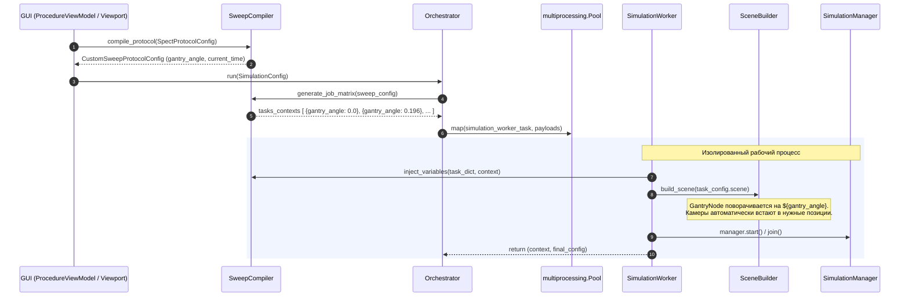

# Архитектурный план: Декомпозиция оркестратора и интеграция узла Gantry

**Статус:** Согласован / В разработке  
**Дата:** 28 сентября 2026  
**Область:** `core/config/`, `core/transport/`, `core/scene/`, `gui/viewmodels/`, `gui/viewport_3d/`  

---

## 1. Контекст и предпосылки рефакторинга

В ходе аудита подсистемы параллельной оркестрации симуляций ([core/config/orchestrator.py](file:///d:/Python%20Projects/NMSimToolkit-Refactor/core/config/orchestrator.py)) и механизмов обработки протоколов исследования (ОФЭКТ / SPECT, ПЭТ / PET, параметрический скан) были выявлены критические архитектурные недостатки:

1. **Монолитность и нарушение SRP:**
   Модуль `orchestrator.py` объединяет 4 несогласованные обязанности:
   - низкоуровневый межпроцессный адаптер паузы `IpcPauseBridge`;
   - статический расчет ракурсов ОФЭКТ `compute_spect_poses` (нужный только GUI-вьюпорту);
   - раздутый воркер выполнения единичной симуляции `_worker_function`;
   - компилятор протоколов и диспетчер пула процессов `Orchestrator`.

2. **Утечка абстракций и жесткий хардкод ОФЭКТ в воркере ядра:**
   Воркер симуляции `_worker_function` содержит императивный поиск гамма-камер в сцене (`_find_gamma_cameras`) и жестко вызывает `cam.set_orbit_position(radius, angle_deg)`. Это грубо нарушает принцип открытости/закрытости (OCP): базовый исполнитель вычислений не должен знать о специфических медицинских устройствах и типах протоколов.

3. **Неполноценная («нечистая») компиляция протоколов в `CustomSweepProtocolConfig`:**
   При компиляции протокола ОФЭКТ в `CustomSweepProtocolConfig` параметр радиуса орбиты теряется и достается воркером через `isinstance(final_config.protocol, SpectProtocolConfig)`. В экспортированной сцене отсутствуют плейсхолдеры для поворота камер, а угловые единицы измерения несогласованы (радианы `hepunits` против градусов в методе `set_orbit_position`).

4. **Отсутствие поворотной станины (Gantry) в графе сцены:**
   Детекторные головки гамма-камер в текущей модели размещаются непосредственно в корневом узле сцены (`World`), что делает невозможным естественное моделирование кинематики томографа через дерево трансформаций.

---

## 2. Архитектурное решение

Решение строится на двух фундаментальных принципах:
1. **Декомпозиция оркестратора** на узкоспециализированные компоненты:
   - `core/transport/ipc_pause_bridge.py` — инфраструктура IPC;
   - `core/geometry/spect_kinematics.py` — доменная математика ракурсов ОФЭКТ;
   - `core/config/sweep_compiler.py` — компиляция параметров и декартово/zip произведение;
   - `core/config/simulation_worker.py` — чистый раннер задачи без знания о типах устройств;
   - `core/config/orchestrator.py` — лаконичный менеджер пула процессов.
2. **Введение узла `GantryNode` в граф сцены:**
   Камеры монтируются как дочерние элементы (`Parent -> Child`) поворотной станины. Вращение ротора описывается стандартным преобразованием `Rotate(z, alpha="${gantry_angle}")`. Это позволяет свести протокол ОФЭКТ к **100% чистому `CustomSweepProtocolConfig`** с единственной переменной вращения.

---

## 3. Модель данных и кинематика Gantry

### 3.1. Иерархия графа сцены

```
Root (CompositeNode / World)
 ├── Patient_Phantom (Volume)
 └── Gantry (GantryNode / CompositeNode)
      ├── GammaCamera_1 (SpatialNode) [локальный монтаж: R=250 мм, phi=0°]
      └── GammaCamera_2 (SpatialNode) [локальный монтаж: R=250 мм, phi=180°]
```

### 3.2. Математика трансформаций

Глобальное положение узлов вычисляется базовым механизмом ядра:
$$\mathbf{M}_{\text{global}} = \mathbf{M}_{\text{parent}} \cdot \mathbf{M}_{\text{local}}$$

* **Матрица Гантри ($\mathbf{M}_{\text{gantry}}$):**
  Задает ориентацию ротора сканера вокруг продольной оси стола $Z$ в изоцентре $(0, 0, 0)$:
  $$\mathbf{M}_{\text{gantry}} = \mathbf{R}_z(\theta_{\text{gantry}})$$

* **Локальная матрица крепления камеры ($\mathbf{M}_{\text{camera\_local}}$):**
  Задает статическое положение каретки на направляющем рельсе гантри:
  $$\mathbf{M}_{\text{camera\_local}} = \mathbf{M}_{\text{orbit}}(\text{radius}=R, \text{angle}=\phi_{\text{mount}}, z=0)$$

* **Динамика сканирования:**
  При повороте гантри локальные матрицы камер $\mathbf{M}_{\text{camera\_local}}$ **не изменяются**. Изменяется исключительно $\mathbf{M}_{\text{gantry}}$, а мировые координаты камер пересчитываются автоматически:
  $$\mathbf{M}_{\text{world\_camera\_1}} = \mathbf{R}_z(\theta_{\text{gantry}}) \cdot \mathbf{M}_{\text{camera\_local\_1}}$$
  $$\mathbf{M}_{\text{world\_camera\_2}} = \mathbf{R}_z(\theta_{\text{gantry}}) \cdot \mathbf{M}_{\text{camera\_local\_2}}$$

---

## 4. Схема взаимодействия компонентов



---

## 5. Кинематические ограничения Gizmo (3D Viewport)

Для интерактивного манипулирования в 3D-вьюпорте вводятся два специализированных кинематических ограничения, реализующих протокол `IKinematicConstraint`:

### 5.1. `GantryKinematicConstraint` (для узла `GantryViewModel`)
* **Физический смысл:** Ротор томографа в изоцентре.
* **Степени свободы (1-DOF):**
  * Строго вращение вокруг оси $Z$ (`GizmoMode.ROTATE`, кольцо $Z$).
  * Линейные перемещения ($X, Y, Z$) и масштабирование заблокированы.
* **Результат:** Синхронный поворот всей системы (станина + все установленные детекторы).

### 5.2. `CameraMountKinematicConstraint` (для узла `GammaCameraViewModel`)
* **Физический смысл:** Каретка детектора на направляющих рельсах гантри.
* **Степени свободы:**
  * Радиальный вылет $R$ (стрелка нормали детектора $Z$ перемещает каретку ближе/дальше к пациенту);
  * Угол монтажа $\phi$ (стрелка $X$ детектора позволяет переключать геометрию $180^\circ \leftrightarrow 90^\circ$);
  * Поворот в собственной плоскости (Landscape / Portrait).
* **Тангенциальный перехват:** При попытке оператора потянуть камеру по касательной к орбите констрейнт транслирует перемещение во вращение родительского узла `GantryViewModel` («потянуть за ручку аппарата»).

---

## 6. Пошаговый план реализации

### Этап 1. Инфраструктурный рефакторинг и математика
- [ ] Создать модуль `core/transport/ipc_pause_bridge.py`, перенести класс `IpcPauseBridge`, добавить экспорт в `core/transport/__init__.py`.
- [ ] Создать модуль `core/geometry/spect_kinematics.py`, перенести функцию `compute_spect_poses`, добавить экспорт в `core/geometry/__init__.py`.
- [ ] Удалить `IpcPauseBridge` и `compute_spect_poses` из `core/config/orchestrator.py`.
- [ ] Обновить импорты в `tests/test_stage1_core.py` и `gui/controllers/viewport_controller.py`.

### Этап 2. Введение узла `GantryNode` и схем конфигурации
- [ ] Создать класс `GantryNode(CompositeNode)` в `core/scene/gantry_node.py`, экспортировать в `core/scene/__init__.py`.
- [ ] В `core/config/models.py` объявить схему `GantryConfig(CompositeNodeConfig)` и включить ее в `AnyNodeConfig`.
- [ ] В `core/config/builder.py` реализовать сборщик `_build_gantry`.
- [ ] В `core/config/exporter.py` реализовать экспорт `GantryNode` в `GantryConfig`.

### Этап 3. Выделение компилятора параметров и чистого воркера
- [ ] Создать модуль `core/config/sweep_compiler.py` с классом `SweepCompiler`:
  - `compile_protocol(protocol) -> CustomSweepProtocolConfig`;
  - `generate_job_matrix(sweep_config) -> List[Dict[str, float]]`;
  - `inject_variables(data, context) -> Any` (с запретом однобуквенных переменных).
- [ ] Создать модуль `core/config/simulation_worker.py` с функцией `simulation_worker_task`:
  - сборка сцены без специфического кода гамма-камер;
  - изоляция `ParticlePropagator`, `DataManager`, `SimulationManager` и `IpcPauseBridge`.
- [ ] Очистить `core/config/orchestrator.py`, сделав его чистым пулом-диспетчером задач.

### Этап 4. Интеграция GUI-слоя и кинематических ограничений
- [ ] Создать `GantryViewModel` в `gui/viewmodels/nodes/gantry_vm.py`.
- [ ] Разделить кинематические ограничения в `gui/viewport_3d/kinematic_constraints.py`:
  - `GantryKinematicConstraint`;
  - `CameraMountKinematicConstraint`.
- [ ] Обновить `SpectProcedureViewModel`:
  - метод `sync_with_scene` монтирует камеры внутрь `GantryViewModel`;
  - метод `get_kinematic_constraint_for_node` возвращает специализированный констрейнт для гантри и камер.
- [ ] Обновить `SceneViewportController` и вызовы предпросмотра ракурсов.

### Этап 5. Тестирование и верификация
- [ ] Написать модульные тесты для `GantryNode` (`tests/geometry/test_gantry.py`).
- [ ] Написать модульные тесты для `SweepCompiler` (`tests/config/test_sweep_compiler.py`).
- [ ] Обновить сквозной тест оркестратора `tests/config/test_orchestrator.py`.
- [ ] Запустить полный набор регрессионных тестов через `.venv\Scripts\pytest.exe`.

---

## 7. Контроль соблюдения правил проекта (`project_rules.md`)

* **Правило 1 (Разделение Core и GUI):** В модулях `core/scene/gantry_node.py`, `core/config/sweep_compiler.py`, `core/config/simulation_worker.py` категорически отсутствуют импорты PySide6, VTK или GUI-моделей.
* **Правило 2 (Отсутствие устаревших костылей):** Полностью удалены `_find_gamma_cameras` и `compute_spect_poses` из оркестратора.
* **Правило 3 (Запрет утиной типизации):** Никаких `hasattr`/`getattr` в ядре — взаимодействие строится строго через контракты `CompositeNode` и `IKinematicConstraint`.
* **Правило 4 (Модульность):** Каждая доменная сущность вынесена в собственный файл и задекларирована в фасадном `__init__.py` с `__all__`.
* **Правило 7 (Язык):** Все комментарии, документация и docstrings написаны на русском языке.
* **Правило 8 (Именование идентификаторов):** Полный отказ от однобуквенных переменных (`camera_index`, `grid_item`, `zipped_item` вместо `i`, `g`, `z`).
* **Правило 9 (Среда выполнения):** Тестирование и запуск выполняются строго в виртуальном окружении `.venv`.
