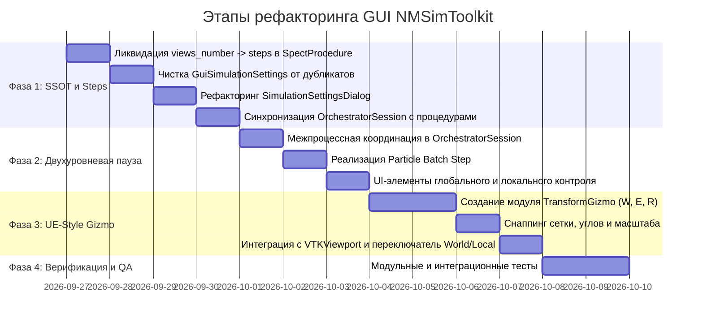

# Детальный план рефакторинга GUI NMSimToolkit (GUI Refactoring Plan)

В данном документе зафиксирован утвержденный поэтапный план устранения выявленных архитектурных несоответствий, наведения строгого принципа единого источника истины (**SSOT**), реализации интерактивного **UE-Style 3D-Gizmo** со снаппингом и **двухуровневой системы паузы/пошагового расчета**.

---

## 1. Паспорт плана рефакторинга

* **Цель:** Приведение подсистемы GUI в полное соответствие с архитектурными стандартами проекта, исключение дублирования параметров, обеспечение эргономики CAD-уровня в 3D-вьюпорте и предоставление физикам интерактивного покадрового анализа переноса частиц.
* **Базовые ограничения:**
  * Никаких графических или специфичных для GUI зависимостей в ядре (`core/`).
  * Полное отсутствие утиной типизации (`hasattr`/`getattr`) во всех слоях.
  * Ядро не должно знать про разделение паузы на «глобальную» и «локальную» — управление паузой на уровне процессов распределяется строго в слое GUI (`OrchestratorSession`).
  * Все переменные имеют предметные, содержательные имена (запрет однобуквенных идентификаторов).

---

## 2. Перечень этапов и задач



---

## Фаза 1. Ликвидация дублирования и наведение SSOT (Single Source of Truth)

### Задача 1.1. Рефакторинг кинематики ОФЭКТ: переход от `views_number` к `steps`
* **Проблема:** Термин `views_number` смешивал число угловых позиций штатива и итоговое число проекций, зависящее от количества детекторных головок.
* **Реализация:**
  1. В [`SpectProcedureViewModel`](file:///d:/Python%20Projects/NMSimToolkit-Refactor/gui/viewmodels/procedure_viewmodel.py) переименовать внутреннее свойство и геттер/сеттер в **`steps: int`** (число дискретных шагов вращения гантри).
  2. Добавить вычисляемое свойство только для чтения:
     ```python
     @property
     def total_projections(self) -> int:
         """Общее число получаемых 2D-проекций: steps * gamma_cameras."""
         return self.steps * self.gamma_cameras
     ```
  3. Обновить формулы расчета углов в `_generate_tasks_contexts()`: каждый шаг $i \in [0, \text{steps}-1]$ задает базовый угол гантри $\theta_i = \theta_{\text{start}} + i \cdot \frac{\theta_{\text{end}} - \theta_{\text{start}}}{\text{steps}}$.
  4. Обновить [`PropertyInspector`](file:///d:/Python%20Projects/NMSimToolkit-Refactor/gui/views/property_inspector.py) и [`ProcedureSelectorWidget`](file:///d:/Python%20Projects/NMSimToolkit-Refactor/gui/views/procedure_selector_widget.py): отображать «Число шагов (Steps)» и поясняющую подпись «Всего проекций (Total Views): $N$».

### Задача 1.2. Очистка `GuiSimulationSettings` от дублирующих полей
* **Проблема:** Структура [`GuiSimulationSettings`](file:///d:/Python%20Projects/NMSimToolkit-Refactor/gui/models/gui_settings.py) дублировала параметры времени, геометрии и обработчиков.
* **Реализация:**
  1. Удалить из `GuiSimulationSettings` следующие поля:
     * ❌ `views_number` (владелец: `SpectProcedureViewModel`)
     * ❌ `stop_time` (владелец: `ProcedureViewModel`)
     * ❌ `angular_range` (владелец: `SpectProcedureViewModel`)
     * ❌ `dose_voxel_size` (владелец: `DoseGridNode` в сцене)
     * ❌ `dose_accumulation_enabled` (владелец: `DoseGridNode.is_active`)
     * ❌ `buffer_capacity` (владелец: `DataManagerViewModel`)
     * ❌ `show_escaped_tracks` (владелец: `DirectStreamHandlerViewModel`)
  2. Оставить в настройках только глобальные параметры ресурсов выполнения и отображения:
     * `particles_number: int` (лимит частиц на задачу)
     * `pool_size: int` (размер пула параллельных процессов)
     * `min_energy: float` (физический порог энергии частиц)
     * `max_tracks_per_batch: int`, `max_tracks_points: int`, `render_as_lines: bool` (лимиты 3D-треков)
     * `grid_snap_step: float`, `angle_snap_step: float` (параметры привязки Gizmo)
  3. Переименовать модель в `ExecutionAndRenderSettings` (или актуализировать `GuiSimulationSettings` в новом компактном виде).

### Задача 1.3. Рефакторинг диалога параметров [`SimulationSettingsDialog`](file:///d:/Python%20Projects/NMSimToolkit-Refactor/gui/views/simulation_settings_dialog.py)
* **Реализация:**
  1. Удалить поля ввода времени счета (`spin_stop_time`) и емкости буфера (`spin_buffer`).
  2. Добавить информационную сноску: *«Параметры времени экспозиции и ракурсов определяются активным протоколом исследования (ОФЭКТ / ПЭТ / CustomSweep)»*.
  3. Оставить в диалоге только вкладки «Вычислительные ресурсы» (пул, частицы, порог энергии) и «Параметры 3D-визуализации» (лимиты треков, шаги сетки снаппинга).

### Задача 1.4. Актуализация сессии [`OrchestratorSession`](file:///d:/Python%20Projects/NMSimToolkit-Refactor/gui/controllers/orchestrator_session.py)
* **Реализация:**
  1. Исключить использование локального `self.stop_time` в пользу параметров активной `self.procedure_vm`.
  2. В методе `generate_jobs()` и `start()` рассчитывать время симуляции строго по правилам процедуры:
     * Для ОФЭКТ: $t_{\text{stop}} = \text{procedure\_vm.time\_per\_view}$.
     * Для CustomSweep: из диапазона sweep-переменных.

---

## Фаза 2. Двухуровневая пауза и пошаговый расчет частиц (Global vs Focused Worker)

### Задача 2.1. Изоляция расчетного ядра и подготовка IPC
* **Архитектурный принцип:** В [`core/transport/simulation_managers.py`](file:///d:/Python%20Projects/NMSimToolkit-Refactor/core/transport/simulation_managers.py) **не создается** никаких дополнительных событий или разделений на локальные/глобальные сущности. Класс `SimulationManager` использует единственный `_pause_event` и уже существующий метод `next_step()`.
* **Реализация в GUI ([`OrchestratorSession`](file:///d:/Python%20Projects/NMSimToolkit-Refactor/gui/controllers/orchestrator_session.py)):**
  1. В контроллере сессии GUI создать через `multiprocessing.Manager`:
     * `global_pause_event = mp_manager.Event()` (по умолчанию взведено `.set()`).
     * `focused_pause_event = mp_manager.Event()` (по умолчанию взведено `.set()`).
     * `step_trigger_event = mp_manager.Event()` (по умолчанию сброшено `.clear()`).
  2. В фабрике `extra_handler_factory` передавать сфокусированному воркеру его персональный `focused_pause_event` и `step_trigger_event`, а фоновым воркерам — `global_pause_event`.
  3. Для сфокусированного воркера внедрить прокси-обертку цикла ожидания: воркер засыпает, если сброшен либо глобальный, либо персональный флаг паузы.

### Задача 2.2. Реализация режима «Шаг частиц фокуса» (Particle Batch Step)
* **Реализация:**
  1. При нажатии «Шаг частиц» в GUI контроллер `OrchestratorSession` кратковременно взводит `step_trigger_event`.
  2. Сфокусированный процесс просыпается, выполняет ровно один шаг `SimulationManager.next_step()` (одна порция инжекции первичных частиц и перенос физики), сбрасывает треки и проекцию через IPC, после чего возвращается в состояние ожидания.
  3. 3D-вьюпорт и `ResultsViewer` немедленно отображают приращение счета.

### Задача 2.3. Новые элементы управления в UI
* **Реализация:**
  1. В главном тулбаре [`MainWindow`](file:///d:/Python%20Projects/NMSimToolkit-Refactor/gui/views/main_window.py):
     * Группа «Пул»: `▶ Запуск`, `⏸ Пауза пула`, `⏹ Стоп`.
     * Группа «Фокус (Воркер #K)»: `⏸ Пауза фокуса`, `⏭ Шаг частиц`.
     * Логика блокировки: кнопка «Пауза фокуса» становится доступной только при `pool_size > 1` (при `pool_size == 1` локальная пауза совпадает с глобальной).
  2. В таблице задач [`SimulationJobsWidget`](file:///d:/Python%20Projects/NMSimToolkit-Refactor/gui/views/simulation_jobs_widget.py) добавить мини-индикаторы статуса для сфокусированного воркера (`RUNNING` / `PAUSED_LOCAL`).

---

## Фаза 3. Интерактивный 3D-Gizmo со снаппингом (UE-Style)

### Задача 3.1. Разработка базового класса `TransformGizmo`
* **Файл:** [`gui/viewport_3d/transform_gizmo.py`](file:///d:/Python%20Projects/NMSimToolkit-Refactor/gui/viewport_3d/transform_gizmo.py).
* **Реализация:**
  1. Создание геометрических полигональных мешей для манипулятора:
     * **Translate:** 3 стрелки вдоль осей $X$ (красный), $Y$ (зеленый), $Z$ (синий) + 3 плоскостных квада $XY, XZ, YZ$.
     * **Rotate:** 3 дуги/тора вокруг координатных осей.
     * **Scale:** 3 осевых куба на концах направляющих.
  2. Поддержка горячих клавиш переключения режимов: `W` — перемещение, `E` — вращение, `R` — масштабирование.

### Задача 3.2. Системы координат и снаппинг (Snapping)
* **Реализация:**
  1. Переключатель пространств:
     * **World Space:** оси манипулятора параллельны мировому базису `np.eye(3)`.
     * **Local Space:** базис манипулятора умножается на матрицу ориентации выбранного объекта `node_vm.global_matrix[:3, :3]`.
  2. Алгоритмы дискретной привязки:
     * **Grid Snap:** округление проекции перемещения на выбранную ось или плоскость с шагом $\Delta_{\text{grid}} \in [1, 5, 10, 50, 100]\text{ мм}$.
     * **Angle Snap:** округление угла поворота с шагом $\Delta_{\text{angle}} \in [5^\circ, 10^\circ, 15^\circ, 30^\circ, 45^\circ, 90^\circ]$.
     * **Scale Snap:** округление приращения физических размеров с шагом $\Delta_{\text{scale}} \in [1, 5, 10]\text{ мм}$.
  3. Временное подавление снаппинга при зажатой клавише `Shift`.

### Задача 3.3. Интеграция с `VTKViewport` и `SceneViewportController`
* **Реализация:**
  1. Подключение обработчиков мыши (`LeftButtonPressEvent`, `MouseMoveEvent`, `LeftButtonReleaseEvent`) через `QtInteractor.iren`.
  2. Использование `vtkPropPicker` для надежного селекта нужной оси/плоскости манипулятора.
  3. Пересчет дельты движения мыши в 3D-смещение через обратную проекцию луча камеры (Ray casting).
  4. Обновление `node_vm.local_matrix` в реальном времени с автоматическим обновлением спинбоксов инспектора свойств.

---

## Фаза 4. Верификация, автоматические тесты и QA

### Задача 4.1. Модульное тестирование SSOT и протоколов
* **Тесты:** `tests/test_stage2_viewmodels.py`.
* **Проверки:**
  * Корректный пересчет `total_projections = steps * gamma_cameras`.
  * Валидация диапазонов `steps >= 1`.
  * Отсутствие устаревших ключей в словаре настроек.

### Задача 4.2. Интеграционное тестирование двухуровневой паузы
* **Тесты:** `tests/test_stage5_controllers.py`.
* **Проверки:**
  * Запуск сессии с `pool_size = 2`.
  * Вызов `pause_focused_worker()`: сфокусированный воркер засыпает, фоновый воркер продолжает инкрементировать число смоделированных частиц.
  * Вызов `step_focused_worker()`: сфокусированный воркер выполняет ровно один `next_step()`, отправляет пакет телеметрии и снова встает на паузу.
  * Вызов `pause_all()`: все процессы пула переходят в состояние паузы.

### Задача 4.3. Тестирование точности снаппинга Gizmo
* **Тесты:** `tests/test_stage3_viewport.py`.
* **Проверки:**
  * Проверка формул привязки координат к сетке 10 мм и углов к сетке 15°.
  * Проверка переключения систем координат World/Local.

---

## 3. Критерии приемки (Definition of Done)

1. В коде проекта полностью отсутствуют поля `views_number`, `stop_time`, `dose_voxel_size` в составе глобального класса `GuiSimulationSettings`.
2. Вся кинематика ОФЭКТ определяется через `steps` и количество детекторов.
3. В расчетном ядре (`core/`) нет никаких графических классов, терминов GUI и раздвоения событий паузы.
4. Кнопки локальной паузы и шага частиц работают стабильно, позволяя заморозить визуализируемый в 3D процесс без остановки фонового пула.
5. Интерактивный Gizmo во вьюпорте позволяет плавно перемещать, вращать и масштабировать объекты сцены с дискретным снаппингом и индикацией в инспекторе свойств.
6. Все 74+ существующих тестов, а также новые тесты этапов 1–4 успешно проходят (`pytest tests/`).
