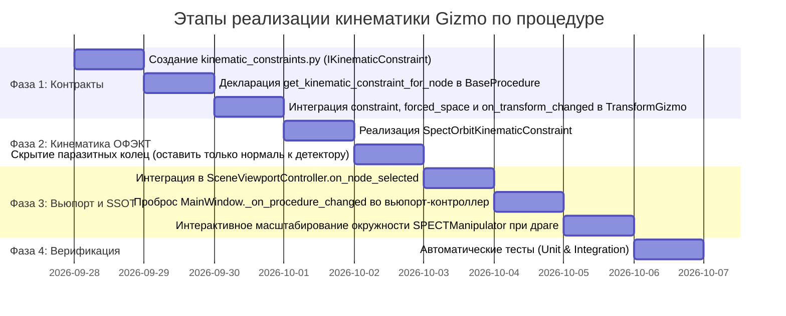

# Архитектурный план: Кинематические ограничения 3D-манипулятора Gizmo по активной процедуре (Procedure-Driven Kinematic Constraints)

В данном документе зафиксирована согласованная архитектура и поэтапный план реализации кинематически ограниченного интерактивного 3D-манипулятора (**Transform Gizmo**) для гамма-камер и процедурных компонентов на базе паттерна **Strategy Factory** (активная процедура выступает поставщиком кинематических ограничений для узлов сцены).

---

## 1. Паспорт архитектурного решения

* **Контекст проблемы:**
  * В текущей версии при выборе узла `GammaCameraViewModel` в дереве сцены манипулятор `TransformGizmo` принудительно отключается (`detach()`), а модуль `SPECTManipulator` является пассивным визуализатором без перехвата мыши. В результате гамма-камера неинтерактивна в 3D.
  * Свободный 6-DOF манипулятор неприменим для медицинской томографии: произвольный наклон или смещение разрушают фокусировку на изоцентр, ломают цилиндрическую геометрию орбиты и рассинхронизируют головки в двухдетекторных системах (Dual-Head).
* **Ключевой архитектурный принцип (Procedure-Driven Constraints):**
  * Сам по себе узел `GammaCameraViewModel` — это физико-геометрический объект сцены (сборка корпуса, коллиматора, кристалла). Он **не должен знать**, по каким правилам он обязан двигаться в рамках того или иного протокола сканирования.
  * **Источником кинематических ограничений является исключительно активная процедура исследования (`BaseProcedureViewModel`)!**
  * Процедура инкапсулирует физику движения сканера (ОФЭКТ, ПЭТ, статическая сцинтиграфия, планарный скан) и предоставляет объектам сцены соответствующие кинематические ограничения через полиморфный фабричный метод `get_kinematic_constraint_for_node(node_vm)`.
  * Манипулятор `TransformGizmo` остаётся универсальным CAD-инструментом, а фильтрация степеней свободы делегируется стратегии `IKinematicConstraint`.

```
                    ┌──────────────────────────────────────────────┐
                    │            BaseProcedureViewModel            │
                    │ +get_kinematic_constraint_for_node(node_vm)  │
                    └──────────────────────┬───────────────────────┘
                                           │ наследует / переопределяет
                                           ▼
                    ┌──────────────────────────────────────────────┐
                    │           SpectProcedureViewModel            │
                    │  - radius: float                             │
                    │  - head_mode: str                            │
                    │  + get_kinematic_constraint_for_node(...)    │
                    └──────────────────────┬───────────────────────┘
                                           │ создает при выборе узла
                                           ▼
                    ┌──────────────────────────────────────────────┐
                    │            IKinematicConstraint              │
                    │        (SpectOrbitKinematicConstraint)       │
                    └──────────────────────┬───────────────────────┘
                                           │ передается во вьюпорт
                                           ▼
┌───────────────────────┐           ┌──────────────────────────────┐
│     Selected Node     │◄──────────┤        TransformGizmo        │
│ (GammaCameraViewModel)│           │ (W: Translate, E: Rotate)    │
└───────────────────────┘           └──────────────────────────────┘
```

---

## 2. Кинематическая и физическая модель

В соответствии с геометрией ядра [`GammaCamera.compute_orbit_matrix`](file:///d:/Python%20Projects/NMSimToolkit-Refactor/core/geometry/gamma_cameras.py#L166-L201) локальный базис детектора гамма-камеры ориентирован следующим образом:
1. **Нормаль лицевой поверхности (локальная ось $+Z$ детектора):**
   * Направлена строго к оси вращения штатива — изоцентру $(0, 0, Z)$.
   * Лицевая поверхность находится на расстоянии `radius` от центра орбиты.
2. **Осевая ось детектора (локальная ось $+Y$ детектора):**
   * Направлена вдоль продольной оси стола пациента (глобальная ось $+Z$).
3. **Поперечная ось детектора (локальная ось $+X$ детектора):**
   * Направлена тангенциально к окружности орбиты (по касательной).

### Матрица доступных действий манипулятора:

| Режим Gizmo | Активный элемент | Кинематическое действие | Влияние на процедуру ОФЭКТ |
| :--- | :--- | :--- | :--- |
| **Translate (`W`)** | **Стрелка $Z$** (перпендикуляр к детектору) | Радиальное перемещение детектора (ближе/дальше к пациенту) | Изменяет **`SpectProcedureViewModel.radius`** синхронно для всех головок. |
| **Translate (`W`)** | **Стрелка $X$** (боковая, вдоль детектора) | Перемещение по дуге окружности орбиты | Изменяет азимутальный угол штатива **`angle`** (базовый угол шага / `start_angle`). |
| **Translate (`W`)** | **Стрелка $Y$** (вдоль стола) | Продольное смещение вдоль стола | Изменяет осевую координату среза **`orbit_z`**. |
| **Rotate (`E`)** | **Кольцо вокруг оси $Z$** (перпендикуляр к детектору) | Вращение головки в собственной плоскости (In-plane roll) | Переключение ориентации детектора **«Альбомная / Книжная»** (Landscape/Portrait) с шагом $90^\circ$. |
| **Rotate (`E`)** | Кольца наклона и крена (Pitch / Tilt) | **Скрыты / Заблокированы** | Предотвращают потерю соосности коллиматора с изоцентром. |
| **Scale (`R`)** | Масштабирование | **Заблокировано** | Размер кристалла и коллиматора физически неизменен. |
| **Координаты (`Q`)** | Переключение World / Local | **Заблокировано (принудительно LOCAL)** | Все перемещения и вращения выполняются строго в локальном базисе детектора. |

> [!IMPORTANT]
> **Принудительная локальная система координат:**
> Все движения и вращения гамма-камеры в режиме процедуры ОФЭКТ выполняются **исключительно в локальной системе координат** детектора. Стрелки манипулятора всегда совпадают с физическими осями детектора (радиальная, тангенциальная, осевая), а не с глобальными $X/Y/Z$ сцены. Кинематическое ограничение `SpectOrbitKinematicConstraint` **принудительно фиксирует** `GizmoSpace.LOCAL` и **блокирует переключение** клавишей `Q` (World/Local).
>
> **Отказ от неочевидного орбитального вращения в режиме Rotate:**
> Попытка заставить кольцо вращения крутить камеру вокруг далекого внешнего изоцентра ломает привычный UX 3D-редакторов. Орбитальное движение вокруг стола полностью передано **боковой стрелке $X$ в режиме Translate (`W`)**. В режиме Rotate (`E`) оставлено **исключительно вращение вокруг оси, перпендикулярной детектору** — это вращает камеру ровно вокруг своего пивота, сохраняя прицел коллиматора на изоцентр и позволяя переключать ориентацию детектора («альбом/портрет»).

---

## 3. Спецификация программных интерфейсов

### 3.1. Фабричный метод в базовом классе процедур ([`BaseProcedureViewModel`](file:///d:/Python%20Projects/NMSimToolkit-Refactor/gui/viewmodels/procedure_viewmodel.py))

```python
class BaseProcedureViewModel(QObject):
    """
    Базовая модель представления протокола физического исследования.
    """
    ...
    def get_kinematic_constraint_for_node(
        self,
        node_vm: NodeViewModel
    ) -> Optional['IKinematicConstraint']:
        """
        Возвращает кинематическое ограничение для выбранного узла в контексте
        данной процедуры. По умолчанию ограничений нет (возвращается None -> свободный 6-DOF).
        """
        return None
```

### 3.2. Реализация в `SpectProcedureViewModel`

```python
class SpectProcedureViewModel(BaseProcedureViewModel):
    """
    Модель представления протокола ОФЭКТ исследования.
    """
    ...
    def get_kinematic_constraint_for_node(
        self,
        node_vm: NodeViewModel
    ) -> Optional['IKinematicConstraint']:
        """
        Для узлов гамма-камер ОФЭКТ накладывает кинематику круговой орбиты гантри.
        Для фантомов, стола и источников возвращает None (стандартный свободный 6-DOF).
        """
        if isinstance(node_vm, GammaCameraViewModel):
            return SpectOrbitKinematicConstraint(procedure_vm=self, camera_vm=node_vm)
        return None
```

### 3.3. Протокол кинематических ограничений (`gui/viewport_3d/kinematic_constraints.py`)

```python
@runtime_checkable
class IKinematicConstraint(Protocol):
    """
    Протокол кинематических ограничений для 3D-манипулятора TransformGizmo.
    """

    def filter_translation(
        self,
        target_node: NodeViewModel,
        proposed_world_delta: np.ndarray,
        initial_matrix: np.ndarray,
    ) -> Tuple[np.ndarray, Dict[str, Any]]:
        """
        Проецирует произвольное 3D-смещение на разрешенные процедурой степени свободы.
        Возвращает:
          - отфильтрованное мировое смещение (np.ndarray shape (3,))
          - словарь параметров для строки состояния и процедуры (например, {'radius': 280.0, 'angle': 45.0})
        """
        ...

    def filter_rotation(
        self,
        target_node: NodeViewModel,
        axis: np.ndarray,
        proposed_angle_deg: float,
        initial_matrix: np.ndarray,
    ) -> Tuple[np.ndarray, float, Dict[str, Any]]:
        """
        Ограничивает вращение только разрешенными осями.
        """
        ...

    def is_scale_allowed(self) -> bool:
        """Разрешено ли масштабирование целевого узла."""
        ...

    def get_forced_space(self) -> Optional[GizmoSpace]:
        """
        Принудительная система координат (например, GizmoSpace.LOCAL для ОФЭКТ)
        или None, если свободное переключение World/Local разрешено.
        """
        ...

    def get_allowed_axes(self, mode: GizmoMode) -> Set[GizmoAxis]:
        """Возвращает набор визуально активных осей и колец для заданного режима."""
        ...

    def on_transform_changed(self, target_node: NodeViewModel, changed_data: Dict[str, Any]) -> None:
        """
        Непрерывное инкрементальное обновление на каждый тик мыши при перетаскивании:
        динамическое масштабирование визуалов орбиты и синхронный предпросмотр положений головок.
        """
        ...

    def on_transform_committed(self, target_node: NodeViewModel, commit_data: Dict[str, Any]) -> None:
        """Фиксация параметров в процедуре при отпускании кнопки мыши (LMB release)."""
        ...
```

### 3.4. Класс ограничений ОФЭКТ (`SpectOrbitKinematicConstraint`)

* Принимает слабую ссылку `weakref.ref(procedure_vm)` и `GammaCameraViewModel`.
* **Принудительная локальная СК:** метод `get_forced_space() -> GizmoSpace.LOCAL`. Клавиша `Q` блокируется, манипулятор всегда ориентирован по осям детектора.
* При радиальном смещении (вдоль локальной оси $Z$ детектора) вычисляет:
  $$R_{\text{new}} = \operatorname{clamp}\left(R_{\text{initial}} + \Delta \vec{p} \cdot \hat{u}_r, \; R_{\min}, \; R_{\max}\right)$$
  Новая матрица формируется строго через `GammaCamera.compute_orbit_matrix(R_new, angle, z, half_thickness)`.
* При боковом смещении (вдоль локальной оси $X$ детектора) вычисляет:
  $$\Delta \theta = \frac{\Delta \vec{p} \cdot \hat{u}_x}{R + h_{\text{thickness}}} \cdot \frac{180^\circ}{\pi}$$
  Новый угол штатива $\theta_{\text{new}} = (\theta_{\text{initial}} + \Delta \theta) \pmod{360^\circ}$.
* В режиме Rotate (`E`):
  * Разрешена **только локальная нормаль $+Z$ детектора** (ось, перпендикулярная детектору).
  * Вращение крутит головку вокруг луча визирования в собственной плоскости детектора.
* **Разделение фаз обновления:**
  * **`on_transform_changed`** — вызывается непрерывно на каждый шаг движения мыши: немедленно перерисовывает направляющую окружность `SPECTManipulator` с новым радиусом $R_{\text{new}}$ и синхронизирует визуальное положение спаренных головок.
  * **`on_transform_committed`** — вызывается один раз при отпускании ЛКМ: фиксирует `procedure_vm.radius = R_new` (или новый базовый угол), эмитит сигналы изменения свойств для `PropertyInspector` и фиксирует транзакцию.

### 3.5. Динамическое связывание во вьюпорте ([`SceneViewportController`](file:///d:/Python%20Projects/NMSimToolkit-Refactor/gui/controllers/viewport_controller.py))

```python
    def on_node_selected(self, node_vm: Optional[NodeViewModel]) -> None:
        """Синхронизация манипулятора с учетом активной процедуры."""
        if node_vm is None:
            if self.transform_gizmo is not None:
                self.transform_gizmo.detach()
            self.spect_manipulator.remove_visuals()
            self.viewport.render()
            return

        # 1. Запрашиваем кинематическое ограничение у АКТИВНОЙ процедуры:
        constraint: Optional[IKinematicConstraint] = None
        if self.procedure_vm is not None:
            constraint = self.procedure_vm.get_kinematic_constraint_for_node(node_vm)

        # 2. Настраиваем манипулятор TransformGizmo:
        if self.transform_gizmo is not None:
            self.transform_gizmo.set_constraint(constraint)
            # Принудительная фиксация системы координат, если требует ограничение
            if constraint is not None:
                forced_space = constraint.get_forced_space()
                if forced_space is not None:
                    self.transform_gizmo.space = forced_space
            self.transform_gizmo.set_target_node(node_vm)

        # 3. Визуальные направляющие ОФЭКТ (круговая орбита):
        if isinstance(node_vm, GammaCameraViewModel) and isinstance(self.procedure_vm, SpectProcedureViewModel):
            self.spect_manipulator.half_thickness = node_vm.half_thickness
            self.spect_manipulator.set_orbit_parameters(
                node_vm.orbit_radius,
                node_vm.orbit_angle,
                z=node_vm.orbit_z,
                render=False,
                emit_signal=False
            )
        else:
            self.spect_manipulator.remove_visuals()

        self.viewport.render()

    def on_procedure_changed(self, new_procedure_vm: BaseProcedureViewModel) -> None:
        """Смена активной процедуры: динамическое обновление кинематических ограничений."""
        self.procedure_vm = new_procedure_vm
        if self.transform_gizmo is not None and self.transform_gizmo.target_node is not None:
            # Перезапрашиваем ограничения у новой процедуры для текущего выбранного объекта
            current_target = self.transform_gizmo.target_node
            new_constraint = self.procedure_vm.get_kinematic_constraint_for_node(current_target)
            self.transform_gizmo.set_constraint(new_constraint)
            if new_constraint is not None:
                forced_space = new_constraint.get_forced_space()
                if forced_space is not None:
                    self.transform_gizmo.space = forced_space
            self.transform_gizmo.update_visuals()
```

В [`MainWindow._on_procedure_changed`](file:///d:/Python%20Projects/NMSimToolkit-Refactor/gui/views/main_window.py#L516):
```python
    def _on_procedure_changed(self, proc_vm: BaseProcedureViewModel) -> None:
        self.procedure_vm = proc_vm
        self.viewport_controller.on_procedure_changed(proc_vm)
```

---

## 4. Поэтапный план реализации



### Фаза 1. Архитектурный контракт кинематических ограничений
1. Создать модуль [`gui/viewport_3d/kinematic_constraints.py`](file:///d:/Python%20Projects/NMSimToolkit-Refactor/gui/viewport_3d/kinematic_constraints.py).
2. Задекларировать протокол `IKinematicConstraint`:
   * Методы: `filter_translation`, `filter_rotation`, `is_scale_allowed`, `get_forced_space`, `get_allowed_axes`, `on_transform_changed`, `on_transform_committed`.
3. В базовом классе [`BaseProcedureViewModel`](file:///d:/Python%20Projects/NMSimToolkit-Refactor/gui/viewmodels/procedure_viewmodel.py) объявить контракт `get_kinematic_constraint_for_node(node_vm) -> Optional[IKinematicConstraint]`.
4. Модифицировать [`TransformGizmo`](file:///d:/Python%20Projects/NMSimToolkit-Refactor/gui/viewport_3d/transform_gizmo.py):
   * Добавить свойство `constraint: Optional[IKinematicConstraint] = None`.
   * При установке `constraint` с непустым `get_forced_space()` принудительно выставлять `self.space` и игнорировать переключение клавишей `Q`.
   * При драге вызывать `constraint.on_transform_changed(...)` на каждый шаг мыши.
   * При отпускании мыши вызывать `constraint.on_transform_committed(...)`.
   * Блокировать переключение в режим `GizmoMode.SCALE` (`R`), если `constraint.is_scale_allowed() is False`.

### Фаза 2. Реализация `SpectOrbitKinematicConstraint`
1. Реализовать класс `SpectOrbitKinematicConstraint(IKinematicConstraint)`:
   * Принудительная локальная СК: `get_forced_space() -> GizmoSpace.LOCAL`.
   * Фильтрация радиального перемещения (стрелка $Z$) $\to$ изменение радиуса $R$.
   * Фильтрация тангенциального перемещения (стрелка $X$) $\to$ поворот штатива на угол $\Delta \theta$.
   * Фильтрация осевого перемещения (стрелка $Y$) $\to$ смещение среза $Z$.
   * Вращение: **разрешено только кольцо вокруг нормали детектора** (in-plane roll: альбомная/книжная ориентация).
   * Реализовать `on_transform_changed` для непрерывного пересчета радиуса/угла и обновления орбиты.
   * Реализовать `on_transform_committed` для фиксации в `procedure_vm.radius` и отправки сигналов.
2. Переопределить `SpectProcedureViewModel.get_kinematic_constraint_for_node`:
   * Возвращать `SpectOrbitKinematicConstraint` для `GammaCameraViewModel`.
   * Возвращать `None` для всех остальных узлов.

### Фаза 3. Интеграция с `SceneViewportController` и `MainWindow`
1. В [`SceneViewportController.on_node_selected`](file:///d:/Python%20Projects/NMSimToolkit-Refactor/gui/controllers/viewport_controller.py#L351):
   * Устранить безусловный `detach()` манипулятора при выборе `GammaCameraViewModel`.
   * Запрашивать ограничение у `self.procedure_vm.get_kinematic_constraint_for_node(node_vm)`.
   * Передавать ограничение в `TransformGizmo` и фиксировать `GizmoSpace.LOCAL`.
2. Реализовать `SceneViewportController.on_procedure_changed`:
   * Динамически перезапрашивать ограничения у новой процедуры при её смене, если узел уже выбран.
3. В [`MainWindow._on_procedure_changed`](file:///d:/Python%20Projects/NMSimToolkit-Refactor/gui/views/main_window.py#L516):
   * Пробрасывать новую процедуру: `self.viewport_controller.on_procedure_changed(proc_vm)`.
4. Связать интерактивное масштабирование траектории орбиты `SPECTManipulator`:
   * Через метод `on_transform_changed` синяя окружность орбиты расширяется/сужается синхронно с рукой пользователя.
5. В строке состояния (`lbl_status` главного окна) отображать контекстную подсказку:
   * При драге $Z$: `ОФЭКТ: Радиус орбиты R = 285.0 мм (Сетка: 10 мм)`.
   * При драге $X$: `ОФЭКТ: Угол штатива θ = 45.0° (Угол: 15°)`.

### Фаза 4. Двусторонняя реактивность мультиголовочной системы (SSOT)
1. При изменении радиуса через Gizmo:
   * Метод `on_transform_changed` временно обновляет визуальные положения спаренных головок.
   * Метод `on_transform_committed` фиксирует `procedure_vm.radius = R_new`.
   * Процедура через `procedure_vm.sync_cameras(camera_vms)` обновляет положения всех остальных головок в сцене (например, второй головки при 90° L-mode или 180° Symmetric).
   * Поля инспектора свойств (`PropertyInspector`) и спинбокс радиуса немедленно обновляются.

### Фаза 5. Автоматические тесты и контроль качества
1. В `tests/test_stage3_viewport.py` добавить тесты:
   * `test_procedure_provides_kinematic_constraint_for_gamma_camera`: проверка вызова `get_kinematic_constraint_for_node`.
   * `test_spect_kinematic_constraint_forced_local_space`: проверка принудительной локальной СК и игнорирования `Q`.
   * `test_spect_kinematic_constraint_radial_translation_updates_radius`: верификация пересчета радиуса и сохранения ориентации на изоцентр.
   * `test_spect_kinematic_constraint_tangential_translation_updates_angle`: верификация поворота гантри по дуге окружности.
   * `test_spect_kinematic_constraint_blocks_scale`: проверка запрета режима масштабирования.
   * `test_spect_kinematic_constraint_single_rotation_axis`: проверка сокрытия паразитных колец наклона/крена и сохранения только кольца нормали детектора.
   * `test_spect_multi_camera_radius_sync_via_gizmo`: проверка синхронного движения второй гамма-камеры при перетаскивании первой через манипулятор.
   * `test_procedure_change_dynamically_updates_gizmo_constraint`: проверка смены ограничений при вызове `MainWindow._on_procedure_changed`.
   * `test_transform_changed_vs_committed_lifecycle`: проверка непрерывного обновления (`on_transform_changed`) и финальной фиксации (`on_transform_committed`).
2. Прогон полного набора тестов (`pytest -v`) для подтверждения отсутствия регрессий.

---

## 5. Критерии приемки (Definition of Done)

1. Кинематические ограничения определяются **активной процедурой** через метод `get_kinematic_constraint_for_node`, а не захардкожены в ноде или вьюпорте.
2. При выборе гамма-камеры в SceneTree манипулятор `TransformGizmo` принудительно работает в **локальной системе координат (`GizmoSpace.LOCAL`)**, переключение клавишей `Q` заблокировано.
3. В режиме перемещения (`W`):
   * Перетаскивание стрелки перпендикулярно детектору плавно меняет радиус орбиты ОФЭКТ.
   * Перетаскивание боковой стрелки вдоль детектора вращает гантри по окружности вокруг пациента.
   * Перетаскивание стрелки вдоль стола сдвигает детектор по высоте среза.
4. Нормаль коллиматора гарантированно сохраняет точную ориентацию на изоцентр $(0, 0, Z)$ при любых перемещениях.
5. В режиме вращения (`E`) отображается только одно кольцо (вокруг нормали к детектору), позволяющее ориентировать прямоугольную головку детектора (альбом/портрет).
6. Режим масштабирования (`R`) для гамма-камер заблокирован.
7. Непрерывное перетаскивание вызывает `on_transform_changed` и визуально обновляет направляющую орбиты в реальном времени, а отпускание ЛКМ вызывает `on_transform_committed` с фиксацией в `procedure_vm.radius`.
8. При изменении радиуса одной головки в двухдетекторной системе вторая головка синхронно адаптирует свой радиус.
9. При смене процедуры «на лету» через `MainWindow._on_procedure_changed` ограничения манипулятора для текущего узла динамически обновляются во вьюпорт-контроллере.
10. Все автоматические тесты проекта успешно проходят со статусом PASS.
