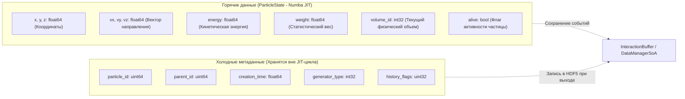
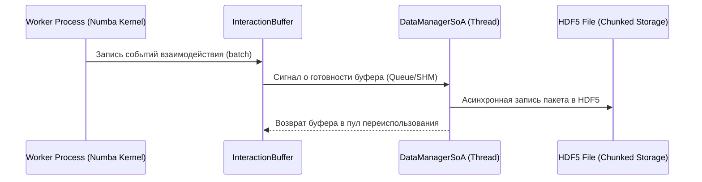

# Архитектура расчетного ядра NMSimToolkit (Core Architecture)

Данный документ описывает фундаментальную архитектуру расчетного ядра (**Core Engine**) программного комплекса **NMSimToolkit**, включая физико-математическую модель, высокопроизводительный Data-Oriented Design (DoD) транспорт частиц, структуру плоских буферов SoA, компилятор геометрии и принципы абсолютной физической точности.

---

## 1. Базовые архитектурные принципы и границы

1. **Абсолютная автономность и изоляция от интерфейса:**
   * Каталог `core/` полностью изолирован от графических зависимостей (`PySide6`, `pyqtgraph`, `vtk`, `pyvista`).
   * В физических структурах ядра отсутствуют визуальные атрибуты, флаги инспектора или UI-состояния (цвет, прозрачность, статус выделения).
   * Ядро оперирует исключительно физическими концепциями: объемы (`Volume`), геометрии, материалы (`Material`), сечения взаимодействий, генераторы частиц (`sources_soa.py`), плоские буферы геометрии (`GeometryBuffer`) и менеджеры транспорта.

2. **Нулевой компромисс физической точности (Zero-Compromise Physics):**
   * Никаких приближений или искусственных аппроксимаций при моделировании физических процессов (фотоэффект, комптоновское рассеяние, рэлеевское рассеяние).
   * Геометрическая навигация и трассировка лучей гарантируют математически точное определение точек пересечения границ объемов с компенсацией погрешностей машинной точности (`epsilon = 1e-8`).

3. **Конвенция физических единиц (hepunits):**
   * Все физические расчеты ведутся строго в согласованной Geant4/HEP системе единиц: длина — **мм**, энергия — **МэВ**, время — **нс**.
   * Запрещены суффиксы размерностей в именах переменных (только `energy`, `linear_attenuation`, `step_size`).

4. **C-подобная надежность и Design by Contract (DbC):**
   * Строгий принцип LBYL (Look Before You Leap): валидация физических инвариантов на входе (`energy > 0`, `size > 0`, `step_size > 0`).
   * Полный запрет утиной типизации (`hasattr`, `getattr`) и подавляющих блоков `try...except`.

---

## 2. Парадигма Data-Oriented Design (DoD) и SoA-буферы частиц

Для достижения максимальной производительности в Numba-компилируемых ядрах вычислений ядро `NMSimToolkit` переведено с объектно-ориентированной модели массивов структур (Array of Structures, AoS) на плоскую компоновку структур массивов (Structure of Arrays, SoA).

### 2.1 Разделение данных частицы на Hot и Cold потоки
Память частицы разделена на две независимые зоны по частоте обращения в цикле трекинга:

* **Горячее состояние (`ParticleState`):** упаковано в плоские массивы NumPy/Numba, непрерывно располагающиеся в кэш-памяти процессора (L1/L2). Все операции перемещения (`_move_particle`) и рассеяния (`_rotate_particle`) выполняются strictly in-place.
* **Холодные данные:** читаются и сохраняются только при генерации первичной частицы или регистрации взаимодействия в детекторе.

---

## 3. Компиляция сцены и навигация: `GeometryCompiler`

### 3.1 Плоский буфер геометрии (`GeometryBuffer`)
Иерархический граф сцены (`SpatialNode`, `CompositeNode`, `Volume`) компилируется в плоские массивы фиксированного размера:
* `transforms`: стек матриц преобразования World-to-Local ($4 \times 4$ `float64`) для каждого узла;
* `inv_transforms`: стек матриц Local-to-World;
* `volume_bounds`: AABB габариты объемов в локальных координатах;
* `volume_materials`: целочисленные идентификаторы материалов (`material_id`);
* `volume_types`: типы геометрических примитивов (Box, Cylinder, Sphere, VoxelVolume, Mesh).

### 3.2 Трассировка Woodcock и Single-Pass Painter's Navigation
Для воксельных объемов со сложным распределением плотности (КТ-фантомы) применяется метод дельта-трекинга Вудкока (Woodcock Tracking):
* Вся масса вокселей нормализуется на максимальный линейный коэффициент ослабления $\mu_{\max}$.
* Длина свободного пробега разыгрывается по фиктивному сечению: $L = -\ln(\xi) / \mu_{\max}$.
* В точке псевдовзаимодействия вычисляется отношение локального $\mu(x,y,z)$ к $\mu_{\max}$ (Russian Roulette). При отсутствии реального взаимодействия частица продолжает движение без смены направления.
* Защита от Epsilon-погрешностей на стыках поверхностей (`1e-8`) предотвращает застревание частиц на границах раздела сред.

---

## 4. Архитектура взаимодействия с физикой (`PhysicsCompiler`)

1. **CSR-структура элементов (`ElementCSR`):**
   * Составы материалов, молярные доли и атомные сечения упаковываются в формат Compressed Sparse Row (CSR) для сверхбыстрого доступа внутри Numba `cfunc`.
2. **Сечения процессов:**
   * Фотоэлектрический эффект (PE), комптоновское (CS) и рэлеевское (RS) рассеяние интерполируются по логарифмическим сеткам энергий.
   * `CFUNCTYPE`-указатели на функции сечений передаются непосредственно в скомпилированные Numba-ядра транспорта.

---

## 5. Система потоковой обработки данных (`DataManagerSoA`)

* **Zero-Allocation:** пул кольцевых буферов предотвращает постоянное выделение памяти в ходе моделирования миллиардов частиц.
* Реляционная структура сохранения в HDF5 (`material_id`, `Z`, координаты, переданная энергия, тип взаимодействия) обеспечивает последующую реконструкцию изображений ОФЭКТ/ПЭТ и расчет поглощенной дозы.
