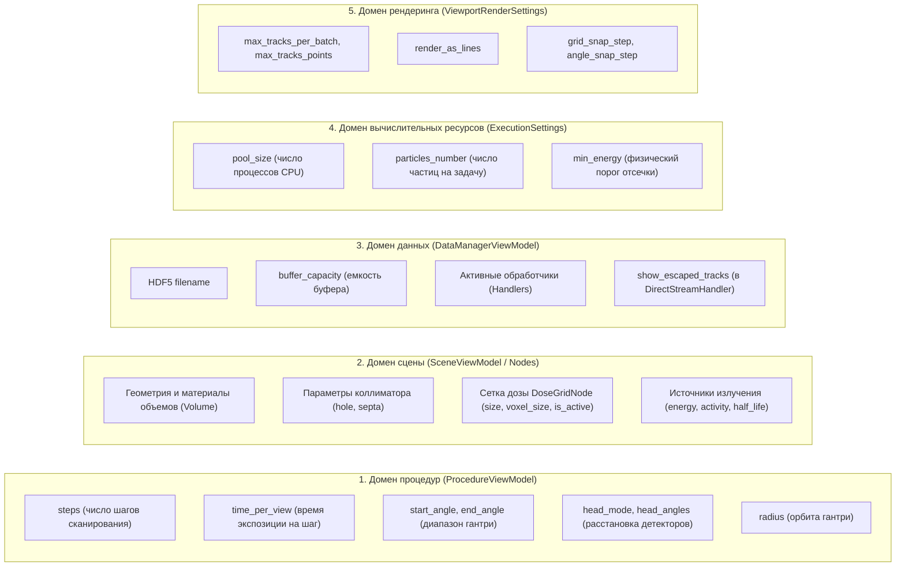
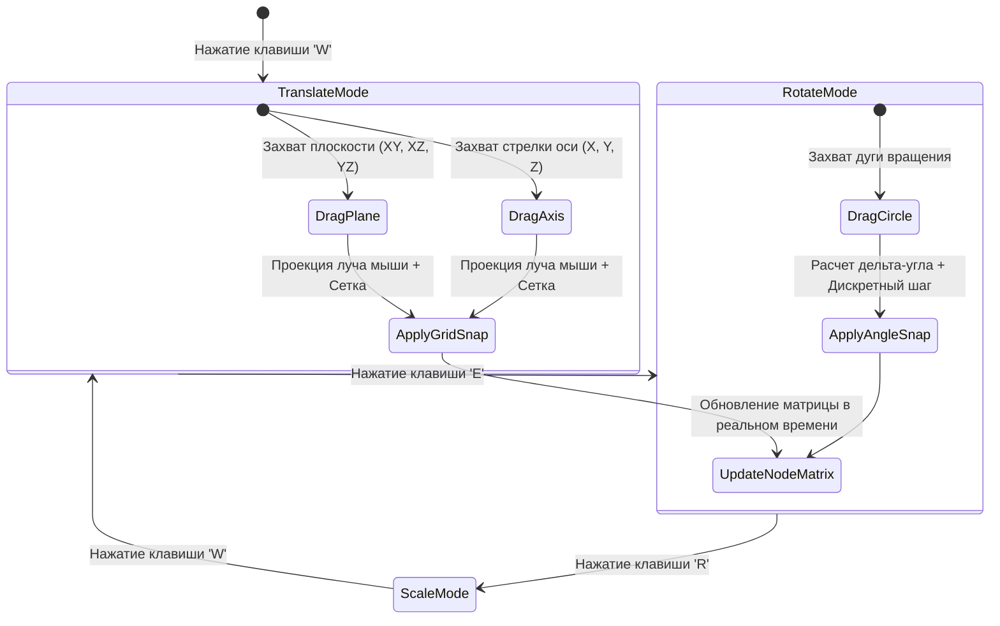
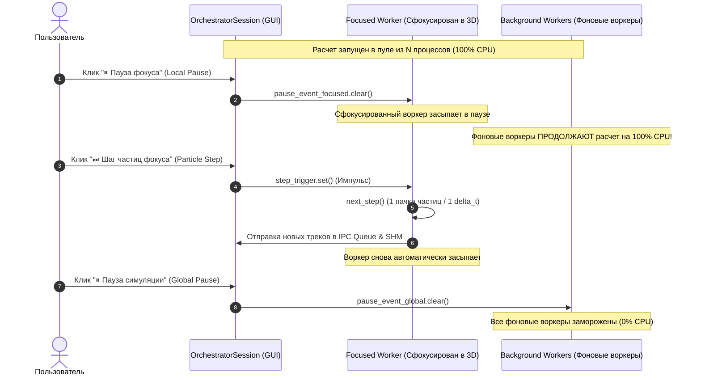
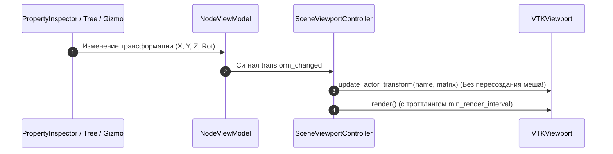

# Архитектура графического интерфейса NMSimToolkit (GUI Architecture)

Данный документ описывает целевую архитектуру графического интерфейса пользователя (**GUI**) программного комплекса **NMSimToolkit**, включая принципы разделения ответственности, контракты взаимодействия с расчетным ядром, организацию межпроцессного обмена (IPC) и подсистему интерактивного 3D-манипулирования.

---

## 1. Базовые архитектурные принципы

Интерфейс спроектирован на базе паттерна **MVVM (Model-View-ViewModel)** с применением выделенных медиаторов сессий ([`SceneViewportController`](file:///d:/Python%20Projects/NMSimToolkit-Refactor/gui/controllers/viewport_controller.py) и [`OrchestratorSession`](file:///d:/Python%20Projects/NMSimToolkit-Refactor/gui/controllers/orchestrator_session.py)).

### Фундаментальные правила архитектуры:
1. **Абсолютная изоляция расчетного ядра (`core/`):**
   * Модули ядра не содержат импортов графических библиотек (`PySide6`, `pyvista`, `vtk`, `pyqtgraph`).
   * В сущностях ядра отсутствуют атрибуты визуализации, флаги инспектора или UI-состояния (например, цвет, прозрачность, статус выделения).
   * **Чистота управляющих примитивов ядра:** Ядро ничего не знает о концепциях «GUI», «Вьюпорт», «Сфокусированный воркер» или «Глобальная vs Локальная пауза». Для любого вычислителя `SimulationManager` в ядре существует ровно один стандартный интерфейс паузы/шага. Вся логика разделения на глобальную и локальную паузу сосредоточена исключительно в слое GUI-оркестрации.
2. **Строгий запрет утиной типизации (`hasattr`/`getattr`):**
   * Все взаимодействия между компонентами GUI, контроллерами и моделями строятся строго через явные методы базовых классов или типизированные протоколы (`@runtime_checkable class Protocol`).
3. **Принцип единого источника истины (Single Source of Truth, SSOT):**
   * Каждый физический и расчетный параметр имеет ровно одного доменного владельца.
   * Полностью исключено дублирование параметров между общими настройками симуляции, протоколами и графом сцены.

---

## 2. Общая компонентная диаграмма системы

```mermaid
flowchart TD
    subgraph UI_ViewLayer ["Слой представлений (View Layer)"]
        MW["MainWindow (Главное окно)"]
        STW["SceneTreeWidget (Иерархия сцены)"]
        PI["PropertyInspector (Инспектор свойств)"]
        VP["VTKViewport (3D Вьюпорт)"]
        RV["ResultsViewer (Телеметрия и результаты)"]
        PSW["ProcedureSelectorWidget (Процедуры)"]
        DHW["DataHandlerListWidget (Обработчики)"]
        SJW["SimulationJobsWidget (Задачи пула)"]
    end

    subgraph ControllerLayer ["Слой контроллеров и сессий (Mediators)"]
        SVC["SceneViewportController (Медиатор 3D-сцены)"]
        OS["OrchestratorSession (Диспетчер сессии расчета)"]
        IPC["IPCReceiver (Фоновый поток телеметрии)"]
        Gizmo["TransformGizmo (UE-Style Манипулятор)"]
    end

    subgraph ViewModelLayer ["Слой моделей представления (MVVM)"]
        SVM["SceneViewModel (Модель сцены)"]
        NVM["NodeViewModel (Узлы сцены)"]
        PVM["ProcedureViewModel (Протокол ОФЭКТ/ПЭТ)"]
        DMVM["DataManagerViewModel (Диспетчер данных)"]
    end

    subgraph CoreLayer ["Расчетное ядро (Core Engine)"]
        CoreScene["CompositeNode / Volumes"]
        Orch["Orchestrator (Параллельный пул)"]
        SimMgr["SimulationManager (Транспорт частиц)"]
    end

    MW --> STW & PI & VP & RV & PSW & DHW & SJW
    STW <--> SVM
    PI <--> NVM & PVM & DMVM
    MW <--> SVC & OS
    SVC <--> VP & Gizmo
    SVC <--> SVM
    OS <--> IPC
    OS <--> Orch
    SVM <--> CoreScene
    Orch --> SimMgr
```



---

## 3. Принцип единого источника истины (SSOT)

В архитектуре GUI строго разграничены 5 независимых доменов ответственности. Ни один параметр не дублируется между доменами:



### Физическая модель ОФЭКТ: отказ от `views_number` в пользу `steps`
* Первичным кинематическим параметром протокола ОФЭКТ является **`steps`** (число дискретных угловых шагов поворота штатива гантри).
* Общее число получаемых двумерных проекций ($N_{\text{projections}}$) является **строго вычисляемым свойством**:
  $$N_{\text{projections}} = N_{\text{steps}} \times M_{\text{gamma\_cameras}}$$
* Угловой шаг сканирования:
  $$\Delta\theta = \frac{\theta_{\text{end}} - \theta_{\text{start}}}{N_{\text{steps}}}$$

---

## 4. Подсистема интерактивного 3D-манипулирования (UE-Style Gizmo)

Для манипулирования объектами сцены в 3D-пространстве реализован манипулятор трансформаций ([`TransformGizmo`](file:///d:/Python%20Projects/NMSimToolkit-Refactor/gui/viewport_3d/transform_gizmo.py)) по стандартам современных CAD и игровых движков (Unreal Engine).

### 4.1. Режимы работы и горячие клавиши:
* **`W` — Translation (Перемещение):**
  * 3 координатные стрелки ($X$ — красный, $Y$ — зеленый, $Z$ — синий).
  * 3 плоскостных квада ($XY, XZ, YZ$) для перемещения параллельно плоскостям проекций.
* **`E` — Rotation (Вращение):**
  * 3 круговых тора вокруг координатных осей.
* **`R` — Scale / Extents (Масштабирование габаритов):**
  * 3 осевых кубических манипулятора для изменения физических размеров объемов ([`Volume.size`](file:///d:/Python%20Projects/NMSimToolkit-Refactor/core/geometry/volumes.py)).



### 4.2. Системы координат (Coordinate Spaces):
* **World Space (Мировые координаты):** Оси манипулятора строго фиксированы по глобальным направлениям сцены.
* **Local Space (Локальные координаты):** Оси манипулятора поворачиваются в соответствии с собственной матрицей ориентации выбранного объекта.

### 4.3. Аппаратная координатная привязка (Snapping):
1. **Translation Snap (Сетка перемещения):**
   * Дискретный шаг: $1\text{ мм}, 5\text{ мм}, 10\text{ мм}, 50\text{ мм}, 100\text{ мм}$.
   * Формула привязки:
     $$x_{\text{snapped}} = \text{round}\left(\frac{x}{\Delta_{\text{grid}}}\right) \cdot \Delta_{\text{grid}}$$
2. **Rotation Snap (Угловая сетка):**
   * Дискретный шаг: $5^\circ, 10^\circ, 15^\circ, 30^\circ, 45^\circ, 90^\circ$.
3. **Scale Snap (Шаг габаритов):**
   * Дискретный шаг: $1\text{ мм}, 5\text{ мм}, 10\text{ мм}$.
4. **Временное отключение привязки:** Удержание клавиши `Shift` переводит манипулятор в режим свободного аналогового перемещения.

---

## 5. Двухуровневая пауза и пошаговый расчет (Global vs Focused Worker)

### 5.1. Архитектурный принцип изоляции ядра
Расчетное ядро ([`core/transport/simulation_managers.py`](file:///d:/Python%20Projects/NMSimToolkit-Refactor/core/transport/simulation_managers.py)) содержит ровно **одно событие управления** (`_pause_event: Event`), используемое в цикле инжекции и переноса частиц:

```python
# Чистый цикл ядра (core/transport/simulation_managers.py):
while not self._stop_event.is_set():
    if not self._pause_event.is_set():
        self._state = SimulationState.PAUSED
        while not self._pause_event.is_set() and not self._stop_event.is_set():
            self._pause_event.wait(timeout=0.05)
        self._state = SimulationState.RUNNING

    self.next_step()
```

Вся логика разделения на **глобальную** и **локальную** паузу реализуется строго на уровне GUI-контроллера сессии ([`OrchestratorSession`](file:///d:/Python%20Projects/NMSimToolkit-Refactor/gui/controllers/orchestrator_session.py)):



### 5.2. Управление событиями в GUI:
* При запуске сессии контроллер [`OrchestratorSession`](file:///d:/Python%20Projects/NMSimToolkit-Refactor/gui/controllers/orchestrator_session.py) выделяет через `multiprocessing.Manager`:
  * `global_pause_event`: управляет всеми фоновыми процессами.
  * `focused_pause_event` и `step_trigger`: передаются воркеру с индексом `focused_job_index`.
* **«Глобальная пауза»:** Замораживает весь пул (0% CPU).
* **«Локальная пауза фокуса»:** Замораживает только визуализируемый в 3D-вьюпорте процесс. Фоновые процессы продолжают непрерывный счет.
* **«Шаг частиц фокуса»:** Выполняет ровно один вызов `SimulationManager.next_step()` в сфокусированном процессе, транслирует сгенерированные треки в 3D-вьюпорт, обновляет 2D-проекцию в `SharedMemory` и возвращает процесс в состояние паузы.

---

## 6. Связность и потоки данных



1. **Реактивность без утечек:**
   * Редактирование в `PropertyInspector` или перетаскивание через `TransformGizmo` модифицирует `NodeViewModel.local_matrix`.
   * `SceneViewportController` перехватывает сигнал и вызывает `update_actor_transform`, меняя матрицу актора напрямую в VTK. Полигональная сетка не пересоздается.
2. **Защита FPS графического интерфейса:**
   * Троттлинг отрисовки треков в [`TrackRenderer`](file:///d:/Python%20Projects/NMSimToolkit-Refactor/gui/viewport_3d/track_renderer.py) (`min_render_interval = 0.05 с`).
   * Троттлинг 3D-карты дозы в [`DoseVolumeRenderer`](file:///d:/Python%20Projects/NMSimToolkit-Refactor/gui/viewport_3d/dose_volume_renderer.py) (`min_render_interval = 0.15 с`).
   * In-place мутация скалярных массивов `vtkImageData` без сброса камеры (`reset_camera=False`).
