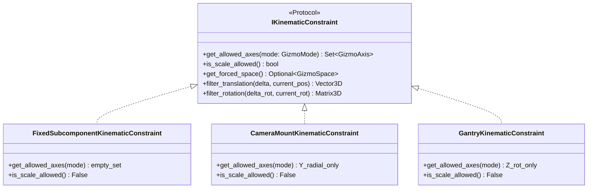

# Кинематическая система, детекторы и координатные преобразования (Kinematics & Detectors)

Данный документ фиксирует архитектурный дизайн кинематической подсистемы программного комплекса **NMSimToolkit**, контракты манипуляций детекторами ОФЭКТ/ПЭТ, станины томографа (`GantryNode`), систему кинематических ограничений (`IKinematicConstraint`) и координатную синхронизацию 3D Gizmo с инспектором свойств.

---

## 1. Концепция физической детекторной головки (`GammaCamera`)

В канонической архитектуре физическая гамма-камера освобождена от орбитальных параметров станины томографа:
* **`GammaCamera`** моделирует физический прибор (детекторную головку): кристалл сцинтиллятора, коллиматор, оптическое стекло и защитный свинцовый корпус.
* Все орбитальные параметры движения (угол вращения станины, радиус орбиты, угол детектора в многоголовочной системе) принадлежат исключительно станине томографа (`GantryNode`).

### 1.1 Геометрические параметры камеры:
* **`detector_size`:** двумерный вектор $[L_x, L_y]$ активного поля зрения сцинтиллятора и коллиматора.
* **Толщины слоев по Z:** `detector_thickness`, `collimator_thickness`, `gap`, `shielding_thickness`, `glass_backend_thickness`.
* **`housing_size`:** вычисляемые внешние габариты корпуса $[X, Y, Z]$, автоматически пересчитываемые в `rebuild_camera()` при изменении любого слоя.

---

## 2. Станина томографа (`GantryNode`) и ОФЭКТ-кинематика

Кинематика многоголовочных гамма-камер и ОФЭКТ/ПЭТ-сканеров сосредоточена в специализированных модулях:
* `core/geometry/spect_kinematics.py`: аналитический расчет орбитальных матриц трансформаций кареток камер:
  $$\mathbf{M}_{\text{orbit}} = \mathbf{T}(0, 0, z) \cdot \mathbf{R}_z(\theta_{\text{gantry}} + \Delta\theta_{\text{head}}) \cdot \mathbf{T}(0, R_{\text{orbit}}, 0) \cdot \mathbf{R}_{\text{tilt}}$$
* Режимы расстановки детекторных головок:
  * **Одиночная камера (Single Head):** фиксированный угол $0^\circ$;
  * **Двухголовочная система 180° (Dual Head 180°):** $0^\circ$ и $180^\circ$ для симметричного сбора проекций;
  * **Двухголовочная система 90° (Dual Head 90°):** кардиологическая геометрия (L-образная);
  * **Трехголовочная система (Triple Head):** шаг $120^\circ$.

---

## 3. Единый контракт кинематических ограничений (`IKinematicConstraint`)

Для предотвращения недопустимых манипуляций геометрией (например, сдвиг кристалла детектора сквозь свинцовый корпус или поворот каретки гантри вне направляющих) в системе действует контракт `IKinematicConstraint`:

### 3.1 Тройная синхронизация степеней свободы (SSOT):
1. **3D Gizmo во вьюпорте:** отображает только те направляющие и кольца вращения, которые разрешены методом `get_allowed_axes()`. При пустом наборе степеней свободы манипулятор скрывается (`detach()`).
2. **2D Property Inspector:** поля ввода координат ($X, Y, Z$), углов Эйлера и размеров динамически становятся `disabled` (серыми / только для чтения) в строгом соответствии с ограничениями.
3. **Панель инструментов (Toolbar):** кнопки переключения режимов (W — Перемещение, E — Вращение, R — Масштабирование) динамически скрываются или блокируются при недоступности соответствующего типа трансформации.

### 3.2 Защита внутренних компонентов (`FixedSubcomponentKinematicConstraint`)
Дочерние узлы сложных составных сборок (`detector_box`, `collimator`, `detector`, `glass_backend` внутри гамма-камеры) защищены от случайного пространственного смещения:
* Их пространственное положение и размеры строго рассчитываются родительским узлом;
* Манипулятор для них заблокирован;
* Пользователю доступны для настройки только компонентные атрибуты (материал, форма отверстий коллиматора, толщина септ).
